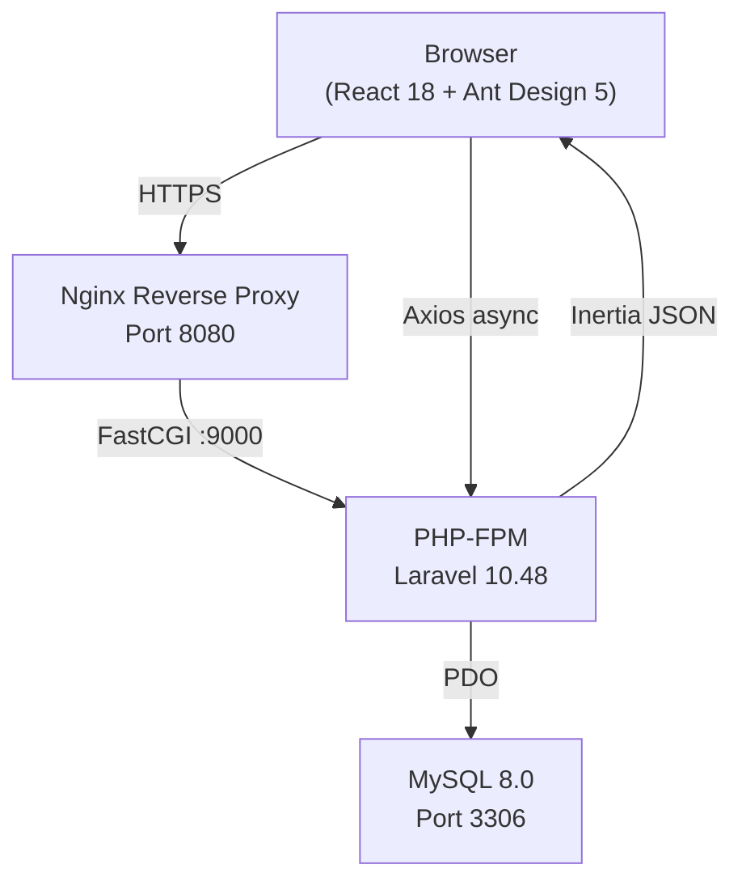
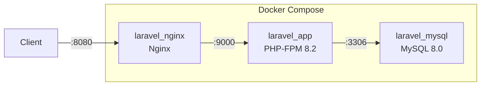
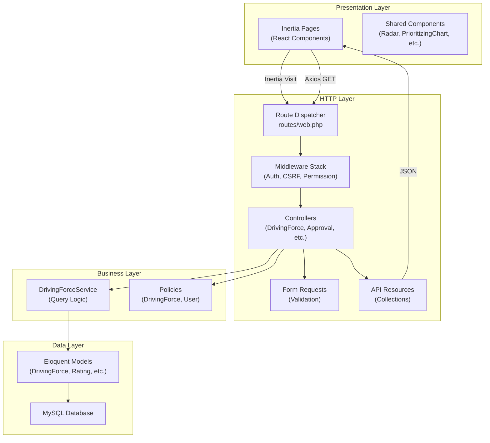
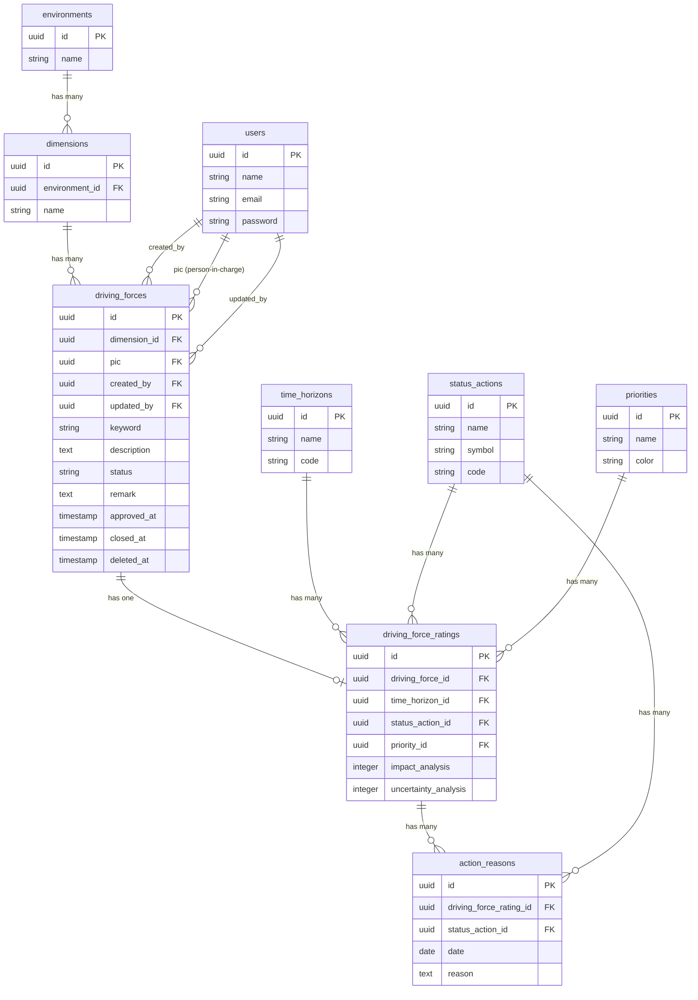
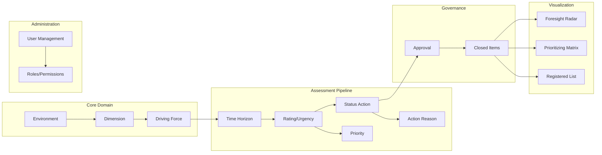
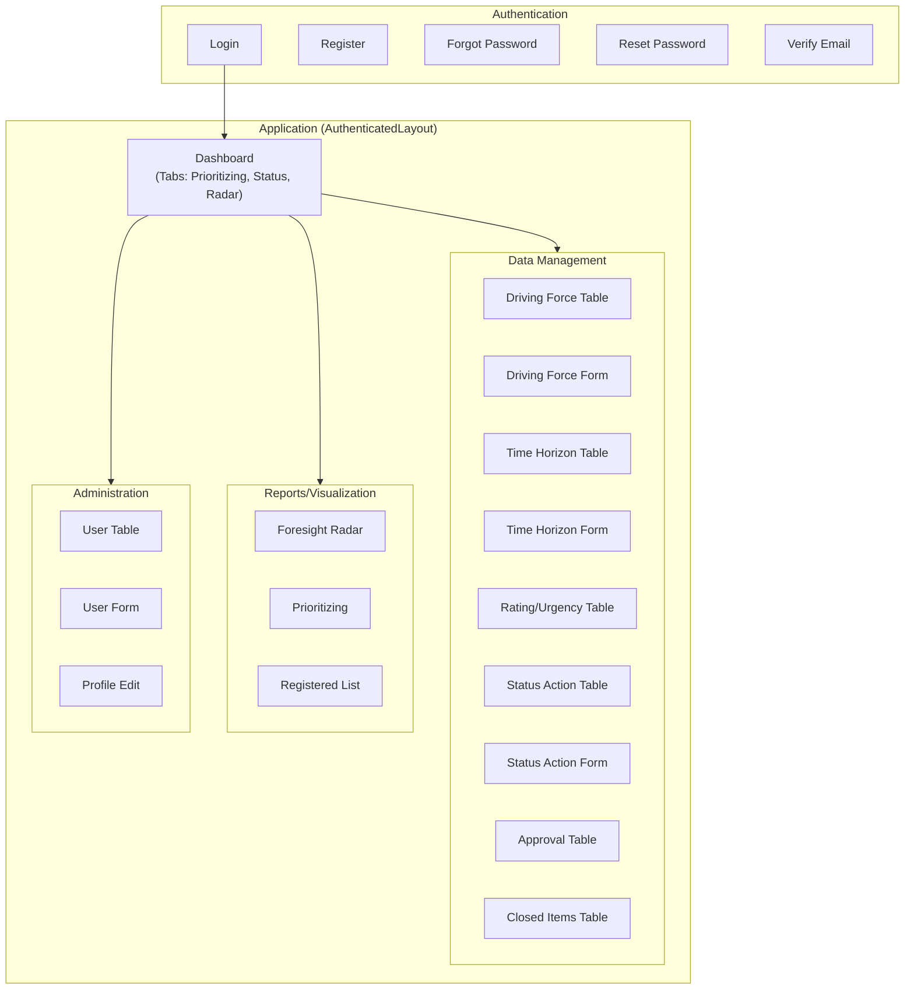

# Foresight Radar: Architecture

**Inspection date:** 2026-10-09

---

## 1. Technology Stack

| Layer | Component | Version | Source |
|---|---|---|---|
| Backend runtime | PHP | ^8.1 (resolved 8.2) | [composer.json L8](file:///c:/laragon/www/foresight-radar/composer.json#L8) |
| Web framework | Laravel | ^10.10 (resolved 10.48.17) | [composer.json L11](file:///c:/laragon/www/foresight-radar/composer.json#L11) |
| Auth scaffolding | Laravel Breeze | ^1.26 (dev) | [composer.json L19](file:///c:/laragon/www/foresight-radar/composer.json#L19) |
| RBAC | Spatie Laravel-Permission | ^6.9 | [composer.json L14](file:///c:/laragon/www/foresight-radar/composer.json#L14) |
| API tokens | Laravel Sanctum | ^3.2 | [composer.json L12](file:///c:/laragon/www/foresight-radar/composer.json#L12) |
| Frontend bridge | Inertia.js (server) | ^0.6.3 | [composer.json L10](file:///c:/laragon/www/foresight-radar/composer.json#L10) |
| Route generation | Ziggy | ^2.0 | [composer.json L15](file:///c:/laragon/www/foresight-radar/composer.json#L15) |
| Frontend framework | React | ^18.2.0 | [package.json L19](file:///c:/laragon/www/foresight-radar/package.json#L19) |
| Frontend bridge (client) | @inertiajs/react | ^1.0.0 | [package.json L12](file:///c:/laragon/www/foresight-radar/package.json#L12) |
| UI components | Ant Design | ^5.19.3 | [package.json L27](file:///c:/laragon/www/foresight-radar/package.json#L27) |
| Icons | @ant-design/icons | ^5.4.0 | [package.json L25](file:///c:/laragon/www/foresight-radar/package.json#L25) |
| Charts | ECharts + echarts-for-react | ^5.5.1 / ^3.0.2 | [package.json L29-L30](file:///c:/laragon/www/foresight-radar/package.json#L29-L30) |
| Charts (secondary) | @ant-design/plots | ^2.2.6 | [package.json L26](file:///c:/laragon/www/foresight-radar/package.json#L26) |
| CSS framework | Tailwind CSS | ^3.2.1 | [package.json L21](file:///c:/laragon/www/foresight-radar/package.json#L21) |
| Build tool | Vite | ^5.0.0 | [package.json L22](file:///c:/laragon/www/foresight-radar/package.json#L22) |
| HTTP client | Axios | ^1.6.4 | [package.json L16](file:///c:/laragon/www/foresight-radar/package.json#L16) |
| Excel export | SheetJS (xlsx) | ^0.18.5 | [package.json L33](file:///c:/laragon/www/foresight-radar/package.json#L33) |
| Date handling | Day.js | ^1.11.12 | [package.json L28](file:///c:/laragon/www/foresight-radar/package.json#L28) |
| Database | MySQL | 8.0 | [docker-compose.yml](file:///c:/laragon/www/foresight-radar/docker-compose.yml) |
| Web server | Nginx | 1.25+ | [docker/nginx/default.conf](file:///c:/laragon/www/foresight-radar/docker/nginx/default.conf) |
| Testing | PHPUnit | ^10.1 | [composer.json L24](file:///c:/laragon/www/foresight-radar/composer.json#L24) |

---

## 2. System Architecture

### Deployment Topology (Docker)

---

## 3. Application Layer Architecture

---

## 4. Database Entity Relationships

---

## 5. Module Dependency Map

---

## 6. Frontend Page Structure

---

## 7. Middleware and Authorization Stack

Every authenticated request passes through this chain:

| Order | Middleware | Purpose |
|---|---|---|
| 1 | `TrustProxies` | Handle proxy headers |
| 2 | `HandleCors` | CORS headers |
| 3 | `PreventRequestsDuringMaintenance` | Maintenance mode |
| 4 | `ValidatePostSize` | Request size limit |
| 5 | `TrimStrings` | Input sanitization |
| 6 | `ConvertEmptyStringsToNull` | Null normalization |
| 7 | `EncryptCookies` | Cookie encryption |
| 8 | `AddQueuedCookiesToResponse` | Cookie management |
| 9 | `StartSession` | Session initialization |
| 10 | `ShareErrorsFromSession` | Validation error sharing |
| 11 | `VerifyCsrfToken` | CSRF protection |
| 12 | `SubstituteBindings` | Route model binding |
| 13 | `HandleInertiaRequests` | Inertia protocol (shares auth, permissions, flash) |
| 14 | `auth` | Authentication gate |
| 15 | `verified` | Email verification gate |
| 16 | `can:permission-name` | Spatie permission gate (per-route) |

Source: [app/Http/Kernel.php](file:///c:/laragon/www/foresight-radar/app/Http/Kernel.php)
