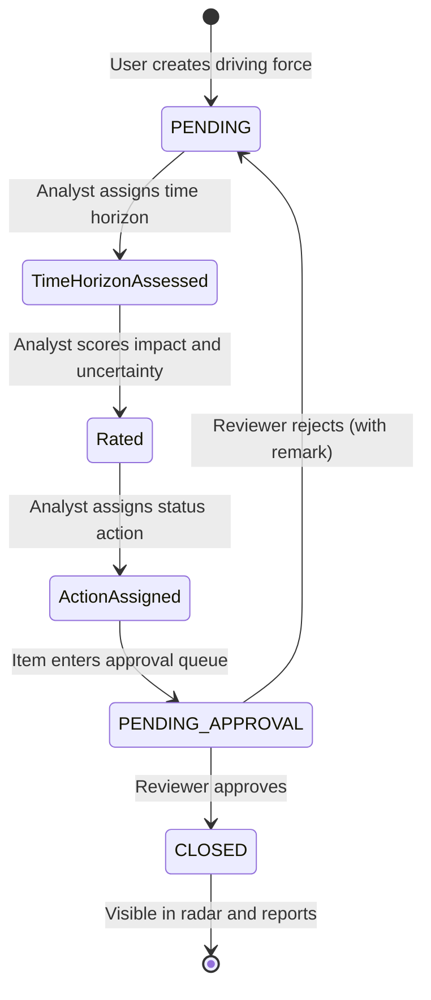
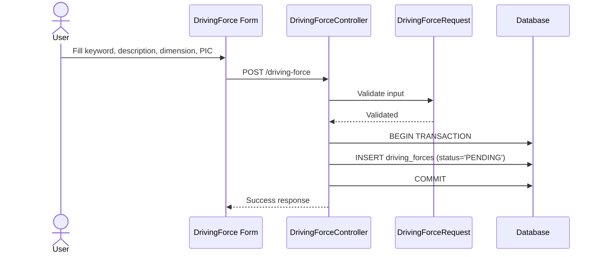
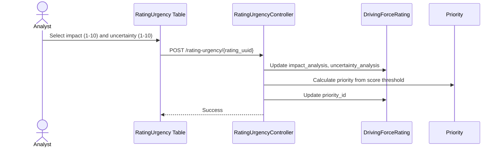
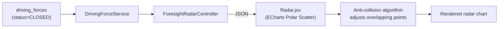
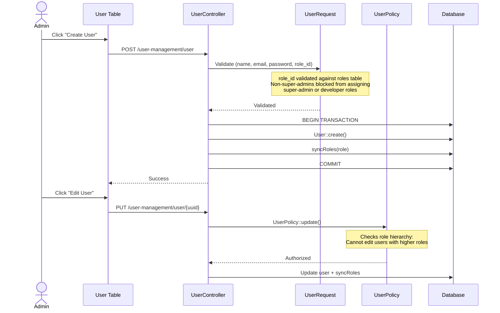
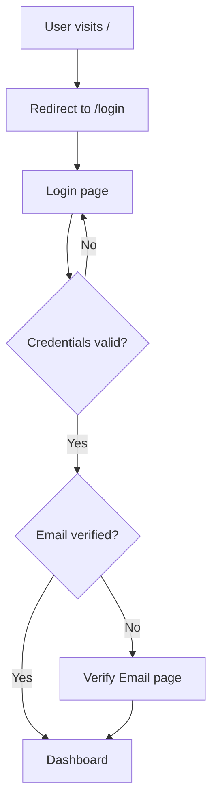
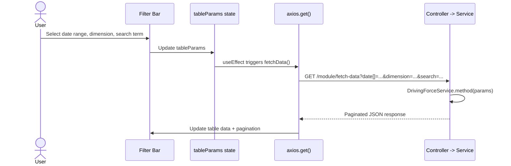

# Foresight Radar: Business Workflows

**Inspection date:** 2026-10-09

---

## 1. Primary Workflow: Driving Force Lifecycle

The core business process moves a driving force from initial creation through assessment and governance to the finalized repository. Each stage is handled by a separate controller and appears as a distinct page in the UI.



### Stage Details

#### Stage 1: Creation

**Controller:** [`DrivingForceController::create`](file:///c:/laragon/www/foresight-radar/app/Http/Controllers/DrivingForceController.php)
**Permission:** `create-driving-force`
**Validation:** [`DrivingForceRequest`](file:///c:/laragon/www/foresight-radar/app/Http/Requests/DrivingForceRequest.php)

| Field | Rules | Notes |
|---|---|---|
| keyword | required, WordCountRule (max words) | Short identifier for the driving force |
| description | required, WordCountRule | Detailed explanation |
| dimension_id | required | Foreign key to dimensions table (no `exists` validation) |
| pic | required | Person-in-charge, foreign key to users (no `exists` validation) |

**Behavior:**
- Status set to `'PENDING'`
- `created_by` set to `auth()->id()`
- Wrapped in `DB::beginTransaction()`



#### Stage 2: Time Horizon Assessment

**Controller:** [`TimeHorizonController::create`](file:///c:/laragon/www/foresight-radar/app/Http/Controllers/TimeHorizonController.php)
**Permission:** `create-time-horizon`

**Behavior:**
- Uses `DrivingForceRating::updateOrCreate()` keyed by `driving_force_id`
- Sets `time_horizon_id` from request
- Creates or updates the `driving_force_ratings` record

**Data flow:**
- Input: driving force ID (route param) + time_horizon_id
- Output: `DrivingForceRating` record linked to driving force

#### Stage 3: Impact and Uncertainty Rating

**Controller:** [`RatingUrgencyController::create`](file:///c:/laragon/www/foresight-radar/app/Http/Controllers/RatingUrgencyController.php)
**Permission:** `create-rating-urgency`

**Behavior:**
- Receives `DrivingForceRating` via route model binding
- Updates `impact_analysis` (1-10) and `uncertainty_analysis` (1-10)
- Calculates `priority_id` based on combined score:

```
if (impact + uncertainty >= 12) -> priority = "High"
if (impact + uncertainty >= 6)  -> priority = "Medium"
otherwise                       -> priority = "Low"
```

- Priority is looked up from the `priorities` table by name



#### Stage 4: Status Action Assignment

**Controller:** [`StatusActionController::create`](file:///c:/laragon/www/foresight-radar/app/Http/Controllers/StatusActionController.php)
**Permission:** `create-status-action`

**Behavior:**
- Receives `DrivingForceRating` via route model binding
- Sets `status_action_id` (Act/Monitor/Park)
- Recalculates `priority_id` from current impact/uncertainty values
- Creates an `ActionReason` record (historical audit log) within a transaction:

```
ActionReason::create([
    'driving_force_rating_id' => $rating->id,
    'status_action_id' => $request->status_action_id,
    'date' => $request->date,
    'reason' => $request->reason,
])
```

#### Stage 5: Approval

**Controller:** [`ApprovalController::create`](file:///c:/laragon/www/foresight-radar/app/Http/Controllers/ApprovalController.php)
**Permission:** `create-approval-items`

**Behavior on Approve:**
- Sets `status = 'CLOSED'`
- Sets `approved_at = now()`
- Sets `closed_at = now()`

**Behavior on Reject:**
- Sets `remark` from reviewer's input
- Status remains `'PENDING'`

#### Stage 6: Closed Repository

**Controller:** [`ClosedItemsController`](file:///c:/laragon/www/foresight-radar/app/Http/Controllers/ClosedItemsController.php)
**Permission:** `view-closed-items`

**Behavior:**
- Read-only view of driving forces with `status = 'CLOSED'`
- Uses `DrivingForceService::closedItems()` for filtered, paginated queries
- Data feeds into visualization components

---

## 2. Visualization Workflows

### 2.1 Foresight Radar

**Route:** `GET /visualization/foresight-radar`
**Permission:** `view-foresight-radar`
**Data source:** [`ForesightRadarController::foresight_radar`](file:///c:/laragon/www/foresight-radar/app/Http/Controllers/ForesightRadarController.php) returns CLOSED driving forces grouped by dimension
**Frontend:** [`Radar.jsx`](file:///c:/laragon/www/foresight-radar/resources/js/Components/Radar.jsx) renders an ECharts polar scatter chart



The radar maps 8 foresight dimensions to fixed polar angles:
- Economy (0deg), Competitor (45deg), Customer (90deg), Supplier (135deg)
- Substitute (180deg), Technology (225deg), Regulation (270deg), Ecology (315deg)

Each dot's radial distance represents the time horizon assessment.

### 2.2 Prioritizing Matrix

**Route:** `GET /visualization/prioritizing`
**Permission:** `view-prioritizing`
**Frontend:** [`PrioritizingChart.jsx`](file:///c:/laragon/www/foresight-radar/resources/js/Components/PrioritizingChart.jsx)

Plots driving forces on a 2D scatter:
- X-axis: Uncertainty (1-10)
- Y-axis: Impact (1-10)
- Color zones: High (red, top-right), Medium (yellow, middle), Low (green, bottom-left)
- Anti-collision: spiral outward search for overlapping data points

### 2.3 Registered List and Export

**Route:** `GET /visualization/registered-list`
**Permission:** `view-registered-list`
**Export:** `GET /visualization/registered-list/export-data` (permission: `export-registered-list`)
**Frontend:** [`OverallStatus.jsx`](file:///c:/laragon/www/foresight-radar/resources/js/Components/OverallStatus.jsx)

Full data table of finalized driving forces with Excel export functionality via the `xlsx` library.

---

## 3. User Management Workflow



---

## 4. Authentication Workflow



Supported auth flows (via Laravel Breeze):
- Email/password login
- User registration (open)
- Password reset via email
- Email verification
- Password confirmation for sensitive actions

---

## 5. Data Filtering Pattern

Every data table and visualization follows the same filtering pattern:



The `DrivingForceService` resolves parameters consistently across all 6 methods:
- `date` array -> date range (defaults to current month)
- `dimension` -> filter by dimension_id
- `search` -> keyword/description prefix match (wrapped in logical closure)
- `pagination.pageSize` -> records per page (default 10)

---

## 6. Permission Matrix

| Role | Dashboard | Driving Force | Time Horizon | Rating | Status Action | Approval | Closed Items | Visualizations | Export | User Mgmt |
|---|---|---|---|---|---|---|---|---|---|---|
| super-admin | Yes | Full CRUD | Full | Full | Full | Full | View | View | Export | Full CRUD |
| developer | Yes | Full CRUD | Full | Full | Full | Full | View | View | Export | Full CRUD |
| admin | Yes | Full CRUD | Full | Full | Full | Full | View | View | Export | Limited CRUD |
| staff | Yes | Create/View | View | View | View | View | View | View | No | No |

Permissions are assigned to roles via the `DefaultSystemSeeder` and stored in Spatie's `role_has_permissions` table.
