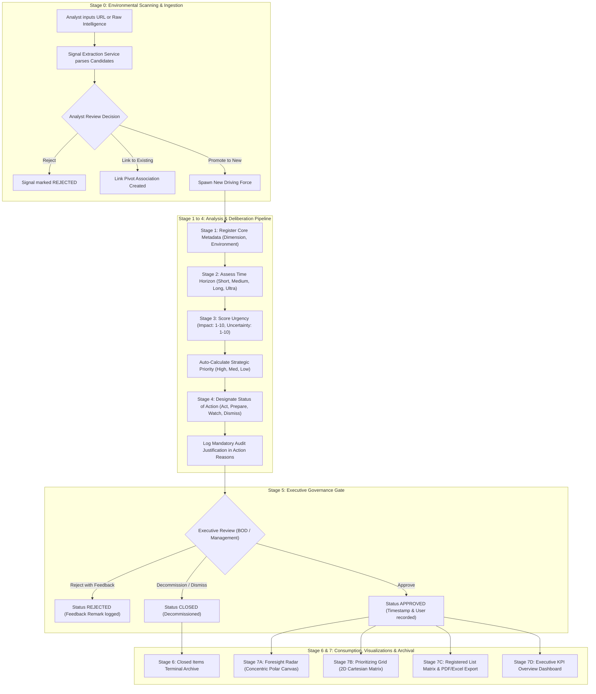
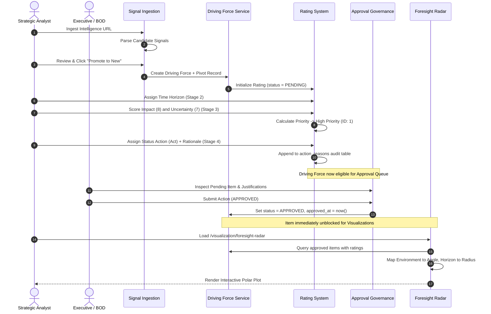

# Feature Integration Map - Foresight Radar

This document provides visual architectural models of feature integration across Foresight Radar. It models the end-to-end business user journey, the technical component dependency graph, and the comprehensive data flow lifecycle using standard Mermaid diagrams.

---

## 1. Business User Journey Map

The following workflow diagram illustrates how human personas (Strategic Analysts, Working Groups, Board of Directors, and Executives) progress through the corporate foresight lifecycle from raw external signals to strategic visualization.

---

## 2. Technical Component Dependency Map

This diagram models the architectural wiring across frontend Inertia views, HTTP controllers, domain services, Eloquent models, and underlying MySQL database tables.

```mermaid
flowchart TD
    subgraph UI["Frontend React & Inertia Layer"]
        V_Signals["Signals/Index.jsx"]
        V_DF["DrivingForces/Index.jsx"]
        V_TH["TimeHorizon/Index.jsx"]
        V_Urgency["RatingUrgency/Index.jsx"]
        V_Status["StatusAction/Index.jsx"]
        V_Appr["Approval/Index.jsx"]
        V_Closed["ClosedItems/Index.jsx"]
        V_Radar["Visualizations/ForesightRadar.jsx"]
        V_Prio["Visualizations/Prioritizing.jsx"]
        V_List["Visualizations/RegisteredList.jsx"]
        V_Dash["Dashboard.jsx"]
    end

    subgraph Controllers["Backend Controllers & Routes"]
        C_Signals["SignalIngestionController"]
        C_DF["DrivingForceController"]
        C_TH["TimeHorizonController"]
        C_Urgency["RatingUrgencyController"]
        C_Status["StatusActionController"]
        C_Appr["ApprovalController"]
        C_Closed["ClosedItemsController"]
        C_Radar["ForesightRadarController"]
        C_Prio["PrioritizingController"]
        C_List["RegisteredListController"]
        R_Dash["web.php Route Closure"]
    end

    subgraph Services["Domain Services Layer"]
        S_Extract["SignalExtractionService"]
        S_DF["DrivingForceService"]
    end

    subgraph Models["Eloquent Domain Models"]
        M_Source["Source"]
        M_Signal["Signal"]
        M_DF["DrivingForce"]
        M_Rating["DrivingForceRating"]
        M_Reason["ActionReason"]
        M_Taxon["Dimension / Environment / TimeHorizon / Priority / StatusAction"]
    end

    subgraph Database["MySQL Relational Schema"]
        T_Sources[("sources")]
        T_Signals[("signals")]
        T_Pivot[("signal_driving_force")]
        T_DF[("driving_forces")]
        T_Ratings[("driving_force_ratings")]
        T_Reasons[("action_reasons")]
        T_Dicts[("lookup dictionaries")]
    end

    %% Wiring
    V_Signals --> C_Signals
    V_DF --> C_DF
    V_TH --> C_TH
    V_Urgency --> C_Urgency
    V_Status --> C_Status
    V_Appr --> C_Appr
    V_Closed --> C_Closed
    V_Radar --> C_Radar
    V_Prio --> C_Prio
    V_List --> C_List
    V_Dash --> R_Dash

    C_Signals --> S_Extract
    C_Signals --> S_DF
    C_DF --> S_DF
    C_Urgency --> S_DF
    C_Status --> S_DF

    S_Extract --> M_Source
    S_Extract --> M_Signal
    S_DF --> M_DF
    S_DF --> M_Rating

    C_TH --> M_Rating
    C_Status --> M_Reason
    C_Appr --> M_DF
    C_Closed --> M_DF
    C_Radar --> M_Rating
    C_Prio --> M_Rating
    C_List --> M_Rating
    R_Dash --> M_DF

    M_Source --> T_Sources
    M_Signal --> T_Signals
    M_Signal --> T_Pivot
    M_DF --> T_Pivot
    M_DF --> T_DF
    M_Rating --> T_Ratings
    M_Reason --> T_Reasons
    M_Taxon --> T_Dicts
```

---

## 3. Data Flow & State Lifecycle Diagram

This diagram charts the data mutation lifecycle of a core foresight item from initial creation to final presentation, demonstrating where derived calculations occur and which features consume the data.

