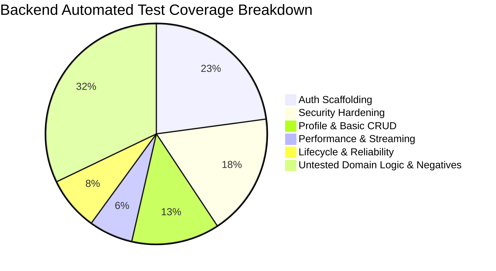

# Foresight Radar: Testing Gaps and Quality Assurance Analysis

**Assessment date:** 2026-10-09  
**Auditor roles:** Senior QA Engineer, Staff Software Engineer  
**Methodology:** Test inventory, code coverage inspection, negative path analysis, automated test execution

---

## 1. Test Suite Baseline

The automated test suite runs via the Docker application container (`docker exec laravel_app php artisan test`).

* **Total Tests:** 61 passed (0 failed, 0 skipped)
* **Total Assertions:** 187 assertions
* **Execution Duration:** 137.98 seconds
* **Test Environment:** PHP 8.2.34 (NTS), SQLite in-memory database (`:memory:`)

```
   PASS  Tests\Unit\ExampleTest (1 test)
   PASS  Tests\Feature\Auth\AuthenticationTest (4 tests)
   PASS  Tests\Feature\Auth\EmailVerificationTest (3 tests)
   PASS  Tests\Feature\Auth\PasswordConfirmationTest (3 tests)
   PASS  Tests\Feature\Auth\PasswordResetTest (4 tests)
   PASS  Tests\Feature\Auth\PasswordUpdateTest (2 tests)
   PASS  Tests\Feature\Auth\RegistrationTest (2 tests)
   PASS  Tests\Feature\AuthorizationTest (2 tests)
   PASS  Tests\Feature\DrivingForceTest (4 tests)
   PASS  Tests\Feature\ExampleTest (1 test)
   PASS  Tests\Feature\Performance\DatabaseIndexTest (2 tests)
   PASS  Tests\Feature\Performance\ExportStreamingTest (3 tests)
   PASS  Tests\Feature\ProfileTest (5 tests)
   PASS  Tests\Feature\RatingUrgencyTest (3 tests)
   PASS  Tests\Feature\Reliability\DateRangeValidationTest (1 test)
   PASS  Tests\Feature\Reliability\TimeHorizonUuidTest (1 test)
   PASS  Tests\Feature\Reliability\UserAccountIntegrityTest (1 test)
   PASS  Tests\Feature\Security\ContainerHardeningTest (2 tests)
   PASS  Tests\Feature\Security\FilterOperatorPrecedenceTest (2 tests)
   PASS  Tests\Feature\Security\InformationDisclosureTest (1 test)
   PASS  Tests\Feature\Security\RoleEscalationTest (3 tests)
   PASS  Tests\Feature\Security\SessionAndHeaderHardeningTest (4 tests)
   PASS  Tests\Feature\Security\VisualizationAuthorizationTest (2 tests)
   PASS  Tests\Feature\Workflow\ForesightLifecycleTest (1 test)
```

---

## 2. Coverage Analysis and Tested Areas

The test suite provides strong regression protection across the following areas:

1. **Authentication Scaffolding (18 tests):** Standard Breeze authentication flows (login, logout, password resets, email verification, password confirmation) are thoroughly covered.
2. **Security Hardening (14 tests):** Role escalation defenses (`RoleEscalationTest`), visualization permission boundaries (`VisualizationAuthorizationTest`), query operator precedence (`FilterOperatorPrecedenceTest`), exception sanitization (`InformationDisclosureTest`), session security headers (`SessionAndHeaderHardeningTest`), and container configurations (`ContainerHardeningTest`) have dedicated regression coverage.
3. **Performance Regressions (5 tests):** Verified database composite index presence on both tables and validated streamed JSON export formats.
4. **End-to-End Workflow Pipeline (1 test):** `ForesightLifecycleTest` exercises the full 6-stage lifecycle sequentially from initial draft creation to approval, closure, and closed-items repository retrieval.

---

## 3. Coverage Blindspots and Testing Gaps

Despite the 57 passing tests, significant gaps remain across unit testing, negative paths, individual controller actions, and frontend algorithms.



### Gap 1: Near Total Absence of Unit Tests
* **Status:** Critical Blindspot
* **Evidence:** Only 1 unit test exists (`Tests\Unit\ExampleTest`), asserting `true === true`.
* **Missing Tests:**
  * No unit tests for `DrivingForceService` helper methods (`resolveDateRange`, `resolvePageSize`).
  * No unit tests for `WordCountRule` custom validation logic.
  * No unit tests for model scopes (`whereDateRange`, `whereKeyword`).
  * No isolated unit tests for priority calculation logic.

### Gap 2: Untested Rejection and Resubmission Workflows
* **Status:** High Priority
* **Evidence:** In `ApprovalController`, only the happy path (approve -> close) is exercised in `ForesightLifecycleTest`.
* **Missing Tests:**
  * Rejection path (`status = 'PENDING'` with reviewer `remark`).
  * Re-submission after rejection (analyst updates driving force and resubmits).
  * Attempting to approve driving forces without completed ratings.
  * Attempting to approve driving forces without an assigned status action.

### Gap 3: Negative Validation Testing on FormRequests
* **Status:** Medium Priority
* **Evidence:** All feature tests submit valid payloads.
* **Missing Tests:**
  * `DrivingForceRequest`: Submitting descriptions or keywords exceeding word limits via `WordCountRule`.
  * `DrivingForceRequest`: Submitting non-existent foreign keys (`dimension_id = 9999`, `pic_id = 9999`).
  * `RatingUrgencyController`: Submitting rating values outside the 1-10 boundary (`value = 0`, `value = 15`, `value = -1`, `value = 'abc'`).
  * `TimeHorizonController`: Submitting invalid time horizon identifiers.

### Gap 4: Individual Controller Isolation
* **Status:** Medium Priority
* **Evidence:**
  * `StatusActionController`: Does not have a standalone feature test class (only touched in the lifecycle test).
  * `TimeHorizonController`: Does not have a standalone feature test class.
  * `ClosedItemsController`: Does not have a standalone feature test class.
  * `PrioritizingController` & `ForesightRadarController`: Have authorization tests, but no tests asserting correct JSON structure, coordinate generation, or handling of empty datasets.

### Gap 5: Zero Frontend Testing
* **Status:** Architectural Gap
* **Evidence:** `package.json` contains no test runners (Jest, Vitest, Cypress, Playwright).
* **Missing Tests:**
  * Custom Euclidean anti-collision algorithm in `Radar.jsx` (`computeAntiCollisionPoints`) has no mathematical test suite.
  * Spiral anti-collision algorithm in `PrioritizingChart.jsx` (`adjustOverlappingPositions`) has no tests.
  * Excel export data mapping in `OverallStatus.jsx` has no automated validation.

---

## 4. Test Suite Quality Evaluation

| Evaluation Criteria | Assessment | Notes |
|---|---|---|
| **Test Fixtures / Setup** | High Quality | Uses `RefreshDatabase`, Laravel factories (`UserFactory`), and programmatic entity creation with explicit UUIDs. |
| **State Teardown** | Clean | SQLite `:memory:` resets database state between tests; no cross-test pollution. |
| **Assertion Precision** | Good | Assertions check HTTP status, database records (`assertDatabaseHas`), array containment, and JSON structures. |
| **Edge Case Handling** | Moderate | Added reliability tests cover date array defects and duplicate names; boundary value tests on numeric inputs are missing. |
| **Host Environment Portability** | Low | Host Windows PHP missing `pdo_sqlite` causes tests to fail outside Docker; tests must run inside `laravel_app` container. |

---

## 5. Recommended Test Implementation Plan

1. **Add `RatingUrgencyValidationTest`:** Assert HTTP 422 when rating values are `< 1` or `> 10`.
2. **Add `ApprovalRejectionTest`:** Assert rejection records remarks and retains `PENDING` status.
3. **Add `WordCountRuleTest` (Unit):** Validate pass/fail boundaries on word count limits.
4. **Add `StatusActionHistoryTest`:** Verify that multiple status action assignments create ordered chronological records in `action_reasons`.
5. **Configure Vitest for Frontend:** Add unit tests for `computeAntiCollisionPoints` in `Radar.jsx`.
