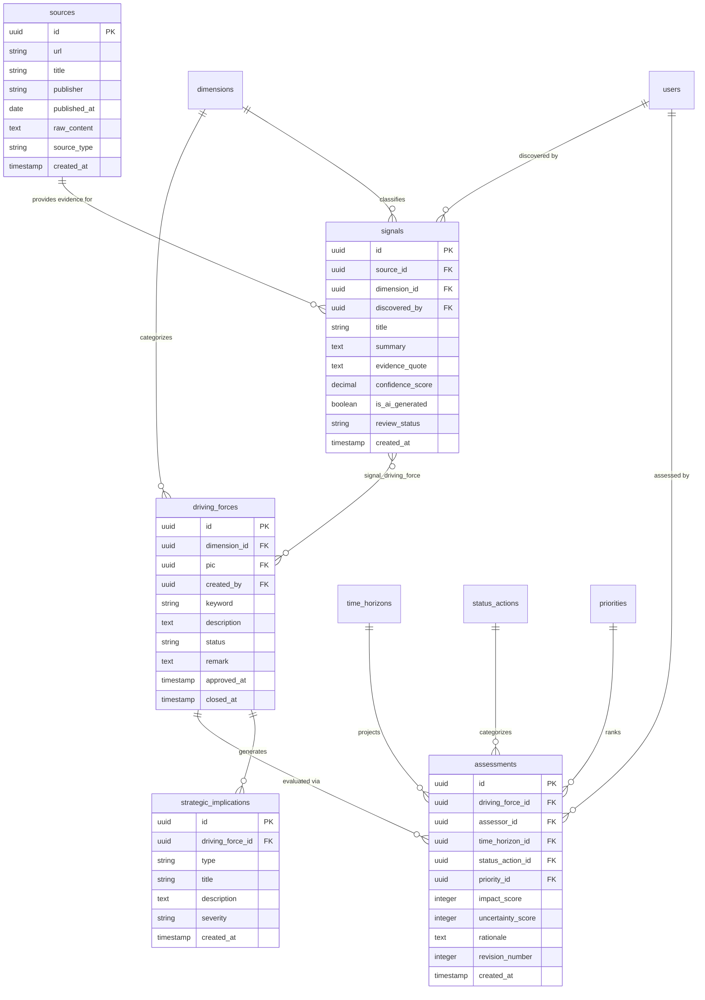
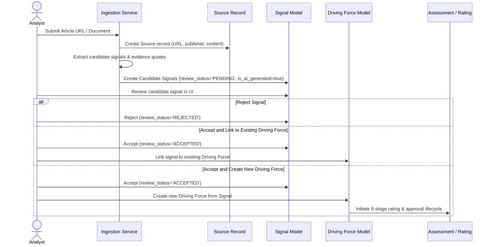

# Foresight Radar: Strategic Foresight Domain Model Specification

**Specification date:** 2026-10-09  
**Auditor roles:** Strategic Foresight Systems Analyst, Product Architect, Staff Software Engineer  
**Status:** Product Specification and Domain Architecture

---

## 1. Domain Concept Taxonomy

Strategic foresight is an evidence-based discipline that translates emerging observations into actionable organizational strategy. The core concepts form a clear analytical hierarchy:

```
[Raw Evidence / External Source]
        │
        ▼
   ┌─────────┐
   │ Signal  │  (Observable evidence of change: regulation, patent, breakthrough)
   └────┬────┘
        │ aggregated into
        ▼
   ┌─────────┐
   │  Trend  │  (Directional pattern supported by multiple signals over time)
   └────┬────┘
        │ shaping
        ▼
┌───────────────┐
│ Driving Force │  (Macro structural shift: demographic, geopolitical, systemic)
└───────┬───────┘
        │ evaluated via
        ▼
 ┌──────────────┐
 │  Assessment  │  (Multi-dimensional scoring: impact, uncertainty, horizon)
 └──────┬───────┘
        │ synthesised into
        ▼
┌───────────────────────┐
│ Strategic Implication │  (Organizational threats, opportunities, and exposures)
└───────┬───────────────┘
        │ driving
        ▼
   ┌─────────┐
   │ Action  │  (Executive decisions, initiatives, experiments, or monitoring)
   └─────────┘
```

---

## 2. Current Implementation vs. Target Domain Model

### Current Database Representation
In the current application:
* **Signals, Trends, and Driving Forces are conflated:** A single table (`driving_forces`) represents both the granular observation (keyword, description) and the macro force.
* **Evidence is absent:** No table or column tracks source URLs, authors, publication dates, or raw snippets.
* **Assessment is singular and destructive:** `driving_force_ratings` has a 1:1 relationship with `driving_forces`. Re-rating an item overwrites prior ratings without preserving score history.
* **Actions are passive labels:** The `status_actions` table assigns three static labels (Act, Monitor, Park). There is no task tracking, ownership assignment, or milestone scheduling.
* **Scenarios and Implications are non-existent:** No schema supports scenario matrices or strategic risk/opportunity logs.

---

## 3. Pragmatic Evolution: The POC-Aligned Domain Model

To support Stage 4 (Signal-to-Insight Proof of Concept) without overengineering, we introduce a minimal set of new entities while reusing existing models where feasible.



---

## 4. Entity-by-Entity Architectural Justification

### 4.1 Entity: `Source`
* **Why it is needed:** Strategic foresight requires provenance. Every signal must link back to verifiable evidence (regulatory filing, peer-reviewed paper, patent announcement, or market data) to prevent fabricated insights.
* **Can existing structure be reused?** No. There is currently no entity storing URLs, publishers, publication dates, or source content.
* **Business capability supported:** Evidence tracking, ingestion, and auditability.
* **Risks:** Unbounded text storage if large articles are saved. Mitigated by storing normalized excerpts, metadata, and external URLs rather than raw full-text dumps.
* **POC Requirement:** **Required for POC (Stage 4).** The Signal-to-Insight flow begins with source ingestion.

---

### 4.2 Entity: `Signal`
* **Why it is needed:** Represents a single piece of evidence indicating possible change. A signal is smaller and more transient than a driving force. Multiple signals validate a driving force over time.
* **Can existing structure be reused?** No. Reusing `driving_forces` would continue the conflation of raw observations with macro strategic forces and corrupt the existing 6-stage lifecycle.
* **Business capability supported:** Weak signal detection, candidate signal ingestion, and human review before formal driving force creation.
* **Risks:** Schema sprawl if too many fields are introduced. Mitigated by keeping fields focused: title, summary, evidence quote, confidence, and review status.
* **POC Requirement:** **Required for POC (Stage 4).** Candidate signals generated by AI ingestion need review before entering the main repository.

---

### 4.3 Relationship: `signal_driving_force` (Pivot Table)
* **Why it is needed:** Many-to-many linkage. A single breakthrough signal (e.g., solid-state battery commercialization) can support multiple driving forces (e.g., Grid Decarbonization, EV Range Parity).
* **Can existing structure be reused?** No.
* **Business capability supported:** Signal clustering and evidence traceability.
* **Risks:** Low complexity standard pivot table (`signal_id`, `driving_force_id`).
* **POC Requirement:** **Required for POC (Stage 4).** Allows analysts to link candidate signals to existing driving forces.

---

### 4.4 Entity: `Assessment` (Evolution of `driving_force_ratings`)
* **Why it is needed:** Replaces destructive 1:1 ratings with versioned evaluation records. Supports assessment revision history, recording who scored what and when, along with written rationales.
* **Can existing structure be reused?** Yes, `driving_force_ratings` can be modified or migrated into `assessments` by adding `assessor_id`, `revision_number`, and `rationale`.
* **Business capability supported:** Assessment audit trail and multi-assessor support.
* **Risks:** Breaking existing visualization queries that rely on `driving_forces.hasOne(rating)`. Mitigated by keeping a `latest_assessment` relationship or keeping `driving_force_ratings` as the active projection.
* **POC Requirement:** **Can wait.** The existing `driving_force_ratings` structure is sufficient for the initial POC. Versioning can be added in future hardening.

---

### 4.5 Entity: `StrategicImplication`
* **Why it is needed:** Connects analytical foresight findings to organizational impact (threats, opportunities, disruptions).
* **Can existing structure be reused?** Partially. `action_reasons` currently captures informal rationale text, but lacks structured classification (threat vs opportunity) or severity.
* **Business capability supported:** Executive briefings and decision traceability.
* **Risks:** Adds cognitive load if required during initial signal creation.
* **POC Requirement:** **Can wait for initial POC.** The POC can output implications as structured text fields within the signal summary, deferring dedicated relational tables to Stage 5.

---

### 4.6 Entity: `Scenario`
* **Why it is needed:** Explores future operating environments through alternative 2x2 matrix combinations of high-impact/high-uncertainty driving forces.
* **Can existing structure be reused?** No.
* **POC Requirement:** **Can wait.** Scenarios are an advanced foresight deliverable and not required for the Signal-to-Insight proof of concept.

---

## 5. End-to-End Signal-to-Insight Lifecycle



---

## 6. Migration and Compatibility Recommendations

1. **Non-destructive expansion:** Do not alter existing `driving_forces`, `dimensions`, or `driving_force_ratings` tables during Stage 3.
2. **Add modular tables for Stage 4 POC:**
   * Create `sources` table.
   * Create `signals` table with `source_id`, `dimension_id`, `is_ai_generated`, and `review_status`.
   * Create `signal_driving_force` pivot table.
3. **Preserve existing visualization pipelines:** The Radar chart and Prioritizing matrix will continue reading from closed driving forces, unaffected by the new ingestion upstream.
