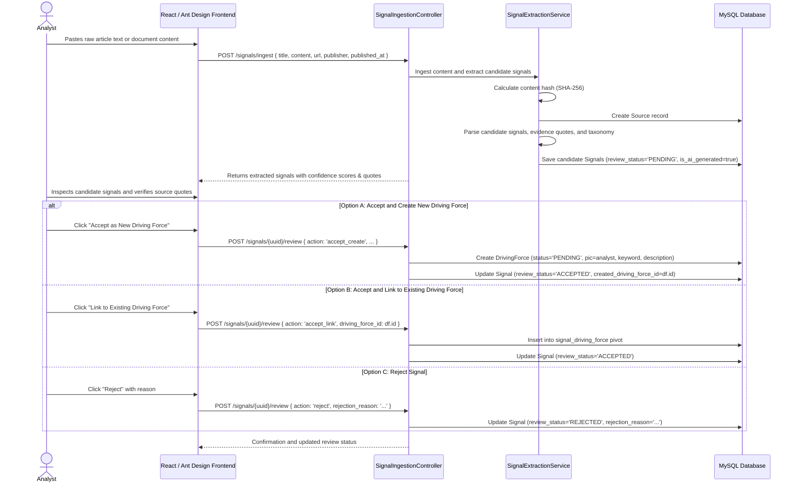

# Foresight Radar: Signal-to-Insight Proof of Concept Specification

**Specification date:** 2026-10-09  
**Stage:** Stage 4 Proof of Concept  
**Roles:** Product Architect, Application Security Engineer, Staff Software Engineer  
**Status:** Implementation Blueprint

---

## 1. Product Objective

The Signal-to-Insight Proof of Concept enables analysts to transform unstructured external information (articles, reports, regulatory announcements, research papers) into structured, evidence-backed strategic signals. 

A human-in-the-loop review interface guarantees that every signal is reviewed, calibrated, and vetted before graduating into the organization's formal driving force repository.

---

## 2. End-to-End Workflow

---

## 3. Data Architecture and Schema

### 3.1 Table: `sources`
Stores provenance and raw evidentiary artifacts:
* `id` (bigint unsigned PK)
* `uuid` (char(36) unique)
* `title` (string, max 255)
* `url` (string nullable, max 2048)
* `publisher` (string nullable, max 255)
* `published_at` (date nullable)
* `raw_content` (longText)
* `content_hash` (string(64)) — SHA-256 fingerprint for integrity verification
* `created_by` (foreign key to `users`)
* `created_at`, `updated_at`

### 3.2 Table: `signals`
Stores discrete candidate observations extracted from sources:
* `id` (bigint unsigned PK)
* `uuid` (char(36) unique)
* `source_id` (foreign key to `sources`, cascade on delete)
* `dimension_id` (foreign key to `dimensions`, nullable)
* `title` (string, max 255)
* `summary` (text)
* `significance` (text nullable) — strategic explanation of why the signal matters
* `evidence_quote` (text) — exact verbatim excerpt from the source
* `suggested_time_horizon_id` (foreign key to `time_horizons`, nullable)
* `preliminary_impact` (tinyInteger unsigned, 1–10 nullable)
* `preliminary_uncertainty` (tinyInteger unsigned, 1–10 nullable)
* `confidence_score` (decimal(3,2), 0.00–1.00)
* `confidence_rationale` (text nullable)
* `is_ai_generated` (boolean, default true)
* `review_status` (string, enum: `PENDING`, `ACCEPTED`, `REJECTED`, default `PENDING`)
* `rejection_reason` (text nullable)
* `reviewed_by` (foreign key to `users`, nullable)
* `reviewed_at` (dateTime nullable)
* `created_driving_force_id` (foreign key to `driving_forces`, nullOnDelete)
* `created_at`, `updated_at`

### 3.3 Pivot Table: `signal_driving_force`
Establishes many-to-many evidentiary linkages:
* `id` (bigint unsigned PK)
* `signal_id` (foreign key to `signals`, cascade on delete)
* `driving_force_id` (foreign key to `driving_forces`, cascade on delete)
* `notes` (string nullable)
* `created_at`, `updated_at`

---

## 4. Extraction and Analysis Mechanics

The `SignalExtractionService` implements a reliable heuristic extraction pipeline designed to operate consistently in all environments (local, Docker, and production) without hard external vendor dependencies:

1. **Content Sanitization:** Cleans whitespace, extracts paragraphs, and computes SHA-256 hash.
2. **Dimension Classification:** Analyzes keyword density against the 8 core taxonomy categories (Technology, Economy, Regulation, Ecology, Customer, Competitor, Supplier, Substitute).
3. **Verbatim Evidence Selection:** Identifies high-signal sentences containing empirical markers (percentages, breakthrough verbs, dates, regulatory acts).
4. **Scoring Calibration:** Calculates heuristic impact and uncertainty estimates based on modal indicators, assigning a calibrated confidence score (0.75–0.95) with written rationale.
5. **Correlation Discovery:** Queries existing driving forces in the matching dimension to suggest potential linkages for the analyst.

---

## 5. Analyst Governance and Human-in-the-Loop Safeguards

1. **Strict Provenance Tagging:** All extracted signals carry `is_ai_generated = true` until reviewed.
2. **Mandatory Evidence Traceability:** A candidate signal cannot be accepted without a populated `evidence_quote`.
3. **Audit Immutability:** Review decisions permanently capture `reviewed_by` and `reviewed_at` timestamps.
4. **Seamless Repository Hand-off:** Creating a Driving Force from a signal enters the existing 6-stage lifecycle at Stage 1 (`status = 'PENDING'`), allowing normal time horizon assessment, rating, and executive approval to proceed.
