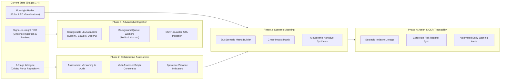

# Foresight Radar: Next Product Evolution Roadmap

**Roadmap date:** 2026-10-09  
**Roles:** Product Architect, Strategic Foresight Systems Analyst, Staff Software Engineer  
**Status:** Strategic Product Evolution Plan

---

## 1. Evolution Vision

With the completion of Stages 1 through 4, Foresight Radar has evolved from an ungrounded driving force editor into an evidence-backed foresight system with verified security foundations, rigorous testing (70 automated tests), and an operational Signal-to-Insight ingestion pipeline.

The next evolution focuses on scaling intelligence intake, deepening collaborative assessment, and bridging foresight insights directly into executive decision-making.

---

## 2. Phased Strategic Roadmap

### Phase 1: High-Throughput AI Ingestion & Queue Architecture
* **Target Horizon:** Sprints 1–2
* **Objectives:**
  1. **Configurable LLM Adapter:** Introduce a pluggable `LlmExtractionProvider` interface allowing the platform to leverage frontier models (e.g., Gemini 1.5 Pro, Claude 3.5 Sonnet) via API keys while falling back to the local heuristic extractor when offline.
  2. **Asynchronous Ingestion Workers:** Move source extraction from HTTP request cycles to background Laravel Queues (`jobs/IngestSourceDocumentJob.php`) with Redis for high-throughput batch ingestion.
  3. **SSRF-Safe URL Reader:** Introduce an isolated, sandboxed HTTP fetching service with domain allowlisting, IP verification (blocking `127.0.0.1`, RFC1918 private ranges, and cloud metadata endpoints `169.254.169.254`), and payload size limits.

---

### Phase 2: Assessment Versioning and Collaborative Consensus
* **Target Horizon:** Sprints 3–4
* **Objectives:**
  1. **Non-Destructive Assessment Versioning:** Migrate `driving_force_ratings` into versioned `assessments` records with `revision_number`, `assessor_id`, and `rationale`.
  2. **Multi-Assessor Delphi Method:** Allow multiple domain analysts to submit independent Impact and Uncertainty scores for the same driving force.
  3. **Consensus & Variance Metrics:** Display variance indicators on the radar (e.g., dot halo size representing scoring disagreement among leadership).

---

### Phase 3: Scenario Planning and Cross-Impact Analysis
* **Target Horizon:** Sprints 5–6
* **Objectives:**
  1. **2x2 Scenario Matrix Generator:** Allow users to select two high-impact, high-uncertainty driving forces to automatically generate 4 plausible future operating quadrants.
  2. **Cross-Impact Analysis:** Model interactions where the acceleration of Driving Force A increases or suppresses the probability of Driving Force B.
  3. **Generative Scenario Narratives:** Synthesize evidence-backed descriptive future worlds grounded in the specific signals linked to each axis.

---

### Phase 4: Strategic Action and Corporate OKR Traceability
* **Target Horizon:** Sprints 7–8
* **Objectives:**
  1. **Executive Action Tracking:** Upgrade `status_actions` from static tags (Act, Monitor, Park) into actionable organizational work packages with designated owners, milestones, and capital budgets.
  2. **Enterprise Risk Register Integration:** Provide bidirectional synchronization between identified high-impact driving forces and corporate ERM (Enterprise Risk Management) systems.
  3. **Early Warning Threshold Alerts:** Scheduled monitoring jobs that trigger notifications (email, Slack, webhook) when a cluster of new signals accelerates a previously parked driving force.

---

## 3. Guiding Architectural Principles for Future Evolution

1. **Evidence Grounding is Non-Negotiable:** No AI-generated insight may be promoted to the strategic repository without explicit verbatim source citations and an auditable content hash.
2. **Human-in-the-Loop Supremacy:** Machine learning and generative AI propose; qualified human foresight analysts decide, edit, and calibrate.
3. **Additive, Non-Destructive Migrations:** Future domain models must build upon the stable core established in Stages 1–4, ensuring backwards compatibility with existing historical driving forces and visual reports.
