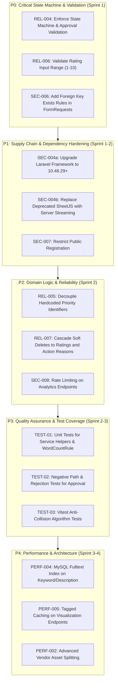

# Foresight Radar: Technical Hardening Roadmap

**Plan date:** 2026-10-09  
**Target repository:** [foresight-radar](https://github.com/roozylabs27/foresight-radar)  
**Roles:** Staff Software Engineer, Application Security Lead, Site Reliability Engineer  
**Status:** Actionable Hardening Plan

---

## 1. Prioritization Framework

Hardening tasks are prioritized using four dimensions:
1. **Severity:** Impact on system integrity, security, or availability (Critical, High, Medium, Low).
2. **Confidence:** Degree of certainty in the defect and proposed fix based on code evidence (High = reproducible/verified).
3. **Business Impact:** Effect on corporate strategic data confidentiality and workflow continuity.
4. **Implementation Effort:** Estimated engineering effort (S = < 4h, M = 4-8h, L = 8-16h, XL = > 16h).



---

## 2. Hardening Milestones and Action Items

### Milestone P0: Critical State Machine and Input Validation (Immediate)

#### Task P0.1: Enforce Lifecycle State Machine and Approval Preconditions (REL-004)
* **Severity:** High | **Confidence:** High | **Effort:** M (6 hours)
* **Target Files:**
  * [`app/Http/Controllers/ApprovalController.php`](file:///c:/laragon/www/foresight-radar/app/Http/Controllers/ApprovalController.php)
  * New FormRequest: `app/Http/Requests/ApprovalRequest.php`
  * [`app/Models/DrivingForce.php`](file:///c:/laragon/www/foresight-radar/app/Models/DrivingForce.php)
* **Implementation Plan:**
  1. Create `ApprovalRequest` with validation:
     ```php
     'status' => ['required', Rule::in(['APPROVED', 'CLOSED', 'REJECTED'])],
     'remark' => ['nullable', 'string', 'max:1000'],
     ```
  2. In `ApprovalController::create()`, enforce state prerequisites before allowing transition:
     * To transition to `APPROVED`: Driving force must have a rating with `time_horizon_id`, `impact_analysis`, `uncertainty_analysis`, and `status_action_id`.
     * To transition to `CLOSED`: Must currently be `APPROVED`.
     * If `REJECTED`: Set status to `PENDING`, store `remark`, and clear approval timestamps.
  3. Write regression test: `tests/Feature/Reliability/ApprovalStateMachineTest.php`.
* **Definition of Done:** Invalid status strings return HTTP 422; approving unrated items returns HTTP 422; rejection preserves `PENDING` status with remark.

---

#### Task P0.2: Enforce Rating Value Range and Types (REL-006)
* **Severity:** Medium | **Confidence:** High | **Effort:** S (3 hours)
* **Target Files:**
  * [`app/Http/Controllers/RatingUrgencyController.php`](file:///c:/laragon/www/foresight-radar/app/Http/Controllers/RatingUrgencyController.php)
  * New FormRequest: `app/Http/Requests/RatingUrgencyRequest.php`
* **Implementation Plan:**
  1. Create `RatingUrgencyRequest`:
     ```php
     'type' => ['required', Rule::in(['impact', 'uncertainty'])],
     'value' => ['required', 'integer', 'between:1,10'],
     ```
  2. Inject `RatingUrgencyRequest` in `RatingUrgencyController::create()`.
  3. Write test in `tests/Feature/RatingUrgencyTest.php` asserting HTTP 422 when `value` is 0, 11, or non-numeric.
* **Definition of Done:** All rating updates outside 1-10 are rejected with HTTP 422.

---

#### Task P0.3: Add Foreign Key Validation in FormRequests (SEC-006)
* **Severity:** Medium | **Confidence:** High | **Effort:** S (3 hours)
* **Target Files:**
  * [`app/Http/Requests/DrivingForceRequest.php`](file:///c:/laragon/www/foresight-radar/app/Http/Requests/DrivingForceRequest.php)
  * [`app/Http/Requests/StatusActionRequest.php`](file:///c:/laragon/www/foresight-radar/app/Http/Requests/StatusActionRequest.php)
  * [`app/Http/Requests/TimeHorizonRequest.php`](file:///c:/laragon/www/foresight-radar/app/Http/Requests/TimeHorizonRequest.php)
* **Implementation Plan:**
  1. Add existence validation:
     * `dimension_id` -> `['required', 'exists:dimensions,id']`
     * `pic_id` -> `['required', 'exists:users,id']`
     * `status_action_id` -> `['required', 'exists:status_actions,id']`
     * `time_horizon_id` -> `['required', 'exists:time_horizons,id']`
  2. Write feature test verifying invalid foreign keys return clean 422 validation errors instead of database driver exceptions.
* **Definition of Done:** Submitting invalid UUID foreign keys yields HTTP 422.

---

### Milestone P1: Supply Chain and Registration Hardening (Sprint 1-2)

#### Task P1.1: Patch Known PHP Dependencies via Minor Composer Update (SEC-004a)
* **Severity:** High | **Confidence:** High | **Effort:** M (4 hours)
* **Target Files:** [`composer.json`](file:///c:/laragon/www/foresight-radar/composer.json), [`composer.lock`](file:///c:/laragon/www/foresight-radar/composer.lock)
* **Implementation Plan:**
  1. Update `laravel/framework` to `>=10.48.29` to resolve CVE-2024-52301 and CVE-2025-27515 without breaking major version compatibility.
  2. Update `league/flysystem` to `>=3.35.3`.
  3. Run full test suite in Docker to verify zero regressions.
* **Definition of Done:** `composer audit` reports zero high/critical advisories against production dependencies.

---

#### Task P1.2: Eliminate Unmaintained SheetJS Dependency (SEC-004b)
* **Severity:** High | **Confidence:** High | **Effort:** M (6 hours)
* **Target Files:**
  * [`package.json`](file:///c:/laragon/www/foresight-radar/package.json)
  * [`resources/js/Components/OverallStatus.jsx`](file:///c:/laragon/www/foresight-radar/resources/js/Components/OverallStatus.jsx#L137)
* **Implementation Plan:**
  1. Switch client-side export in `OverallStatus.jsx` to download directly from the server streamed endpoint (`GET /visualization/registered-list/export-data`) rather than using client-side SheetJS (`xlsx`).
  2. Remove `"xlsx": "^0.18.5"` from `package.json`.
  3. Rebuild frontend assets (`npm run build`).
* **Definition of Done:** `npm audit` no longer flags SheetJS prototype pollution; Excel export functions via server-side streaming.

---

#### Task P1.3: Restrict Public Account Registration (SEC-007)
* **Severity:** Medium | **Confidence:** High | **Effort:** S (2 hours)
* **Target Files:**
  * [`routes/auth.php`](file:///c:/laragon/www/foresight-radar/routes/auth.php#L15-L21)
  * [`resources/js/Pages/Welcome.jsx`](file:///c:/laragon/www/foresight-radar/resources/js/Pages/Welcome.jsx)
* **Implementation Plan:**
  1. Disable open public `/register` route in production environments or gate it behind an invitation code or administrative role.
  2. Remove public "Register" link from `Welcome.jsx` when registration is disabled.
* **Definition of Done:** Anonymous users cannot arbitrarily create accounts on enterprise deployments.

---

### Milestone P2: Domain Reliability and Throttling (Sprint 2)

#### Task P2.1: Centralize Priority Calculation Logic (REL-005)
* **Severity:** Medium | **Confidence:** High | **Effort:** S (3 hours)
* **Target Files:**
  * [`app/Models/DrivingForceRating.php`](file:///c:/laragon/www/foresight-radar/app/Models/DrivingForceRating.php)
  * [`app/Http/Controllers/RatingUrgencyController.php`](file:///c:/laragon/www/foresight-radar/app/Http/Controllers/RatingUrgencyController.php)
  * [`app/Http/Controllers/StatusActionController.php`](file:///c:/laragon/www/foresight-radar/app/Http/Controllers/StatusActionController.php)
* **Implementation Plan:**
  1. Add `calculatePriority(): ?int` method to `DrivingForceRating`.
  2. Resolve priority record by name ('High', 'Medium', 'Low') from database or cache rather than hardcoded integer IDs (`1`, `2`, `3`).
  3. Call `$rating->calculatePriority()` in both controllers to eliminate duplicate logic.
* **Definition of Done:** Single source of truth for priority calculation; priority IDs resolved dynamically.

---

#### Task P2.2: Rate Limiting on Analytics and Export Endpoints (SEC-008)
* **Severity:** Low | **Confidence:** High | **Effort:** S (2 hours)
* **Target Files:** [`routes/web.php`](file:///c:/laragon/www/foresight-radar/routes/web.php)
* **Implementation Plan:**
  1. Apply `throttle:60,1` to `/visualization/*` data and export routes.
* **Definition of Done:** Exceeding 60 requests/minute returns HTTP 429 Too Many Requests.

---

### Milestone P3: Quality Assurance and Test Expansion (Sprint 2-3)

#### Task P3.1: Unit Tests for Services and Validation Rules (TEST-01)
* **Severity:** Medium | **Confidence:** High | **Effort:** M (6 hours)
* **Target Files:**
  * `tests/Unit/DrivingForceServiceTest.php`
  * `tests/Unit/WordCountRuleTest.php`
* **Implementation Plan:**
  1. Test `WordCountRule` boundary limits (exact word count, +1 word failure, empty string).
  2. Test `DrivingForceService::resolveDateRange()` with valid array, inverted dates, null, and non-array strings.
* **Definition of Done:** Unit test suite contains at least 15 focused tests.

---

#### Task P3.2: Rejection and Workflow Edge-Case Integration Tests (TEST-02)
* **Severity:** Medium | **Confidence:** High | **Effort:** M (6 hours)
* **Target Files:** `tests/Feature/Workflow/ApprovalWorkflowTest.php`
* **Implementation Plan:**
  1. Test rejection path: reviewer submits status `REJECTED` with remark.
  2. Test resubmission: driving force updated and resubmitted.
  3. Test unauthorized user attempting to approve (403 Forbidden).
* **Definition of Done:** Full lifecycle coverage for negative and branching governance paths.

---

### Milestone P4: Performance and Scalability (Sprint 3-4)

#### Task P4.1: Tagged Caching for Visualization Endpoints (PERF-005)
* **Severity:** Medium | **Confidence:** High | **Effort:** M (6 hours)
* **Target Files:**
  * [`app/Http/Controllers/ForesightRadarController.php`](file:///c:/laragon/www/foresight-radar/app/Http/Controllers/ForesightRadarController.php)
  * [`app/Http/Controllers/PrioritizingController.php`](file:///c:/laragon/www/foresight-radar/app/Http/Controllers/PrioritizingController.php)
  * [`app/Observers/DrivingForceObserver.php`](file:///c:/laragon/www/foresight-radar/app/Observers/)
* **Implementation Plan:**
  1. Cache analytics query results keyed by date and dimension filter hashes.
  2. Invalidate cache on driving force status transitions to `CLOSED` or on deletions.
* **Definition of Done:** Analytical requests return cached responses within < 20ms under repeat load.

---

## 3. Execution Summary Table

| Milestone | Task | Severity | Effort | Target Branch | Dependencies |
|---|---|---|---|---|---|
| **P0** | P0.1 State machine & approval validation | High | 6h | `feature/state-machine-validation` | None |
| **P0** | P0.2 Rating input range (1-10) | Medium | 3h | `feature/rating-range-validation` | None |
| **P0** | P0.3 Foreign key existence validation | Medium | 3h | `feature/fk-exists-rules` | None |
| **P1** | P1.1 Laravel framework patch update | High | 4h | `chore/patch-framework-dependencies` | Tests passing |
| **P1** | P1.2 Replace SheetJS with server streaming | High | 6h | `fix/remove-sheetjs-dependency` | None |
| **P1** | P1.3 Restrict public registration | Medium | 2h | `feature/restrict-registration` | None |
| **P2** | P2.1 Centralize priority calculation | Medium | 3h | `refactor/priority-service` | P0.2 |
| **P2** | P2.2 Rate limiting on analytics endpoints | Low | 2h | `feature/route-throttling` | None |
| **P3** | P3.1 Unit tests for rules & service helpers | Medium | 6h | `test/service-unit-coverage` | None |
| **P3** | P3.2 Rejection & governance edge tests | Medium | 6h | `test/approval-rejection-flow` | P0.1 |
| **P4** | P4.1 Tagged caching for visualizations | Medium | 6h | `perf/visualization-cache` | P0.1 |
